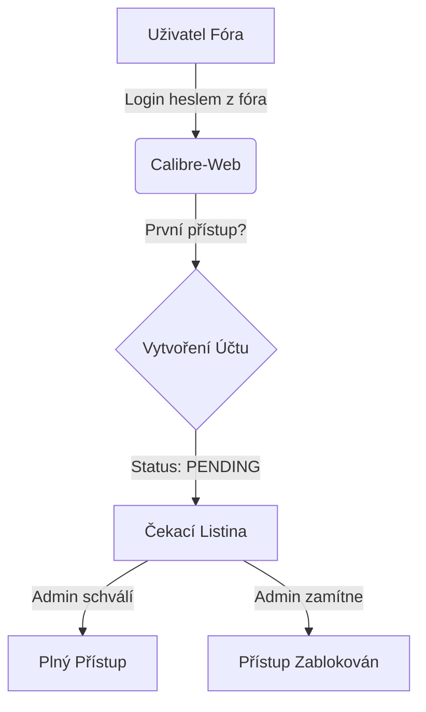
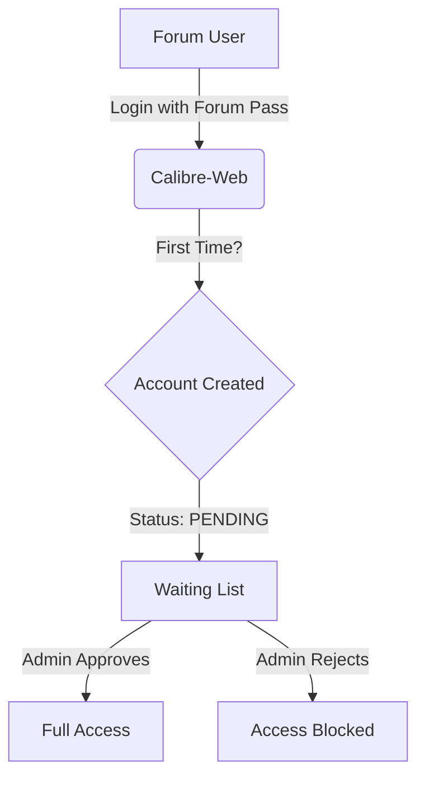

# Průvodce Registrací a Prvním Přihlášením
*(Registration & First Login Guide)*

[Česky](#česky) | [English](#english)

---

# Česky

## 1. Jak se zaregistrovat?
V knihovně "CalibreWEB Advanced" **nevytváříte nový účet**. Váš účet je propojen s diskuzním fórem.

### Krok 1: Použijte své údaje z Fóra
Na přihlašovací obrazovce zadejte své **uživatelské jméno a heslo**, které používáte na **phpBB fóru**.
- Nemusíte se nikde registrovat předem.
- Systém vás automaticky rozpozná.

### Krok 2: Čekací listina (Waiting List)
Po prvním úspěšném přihlášení **neuvidíte knihy ihned**.
Uvidíte obrazovku s informací: **"Váš účet čeká na schválení administrátorem."**

### Krok 3: Schválení
Jakmile administrátor váš přístup potvrdí (obvykle do 24 hodin), při příštím přihlášení (nebo obnovení stránky) již uvidíte plnou knihovnu.

## 2. Řešení problémů
- **"Nesprávné jméno nebo heslo"**: Zkontrolujte, zda se s těmito údaji opravdu přihlásíte na fórum. Pokud jste si změnili heslo na fóru, změna se v knihovně projeví ihned.
- **Dlouhé čekání**: Pokud čekáte déle než 48 hodin, kontaktujte administrátora na fóru soukromou zprávou.

---

# English

## 1. How to Register?
In the "CalibreWEB Advanced" library, you **do not create a new account**. Your account is linked to the discussion forum.

### Step 1: Use your Forum Credentials
On the login screen, enter your **username and password** from the **phpBB forum**.
- No prior registration is needed within the library itself.
- The system automatically recognizes you.

### Step 2: Waiting List
After your first successful login, you **will not see books immediately**.
You will see a screen stating: **"Your account is waiting for administrator approval."**

### Step 3: Approval
Once an administrator confirms your access (usually within 24 hours), you will see the full library upon your next login (or page refresh).

## 2. Troubleshooting
- **"Invalid username or password"**: Verify that these credentials work on the forum. If you changed your password on the forum, it updates in the library immediately.
- **Long Wait**: If you have been waiting longer than 48 hours, send a private message to an administrator on the forum.
